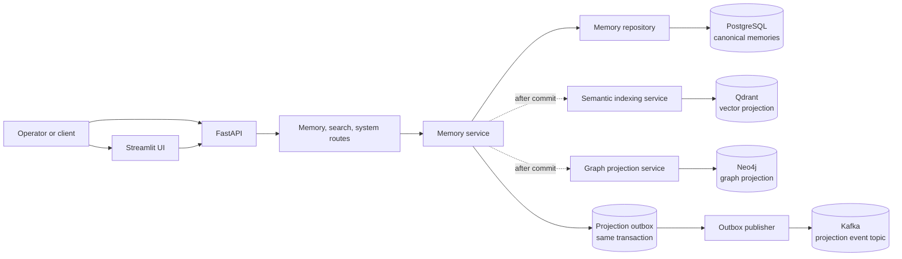
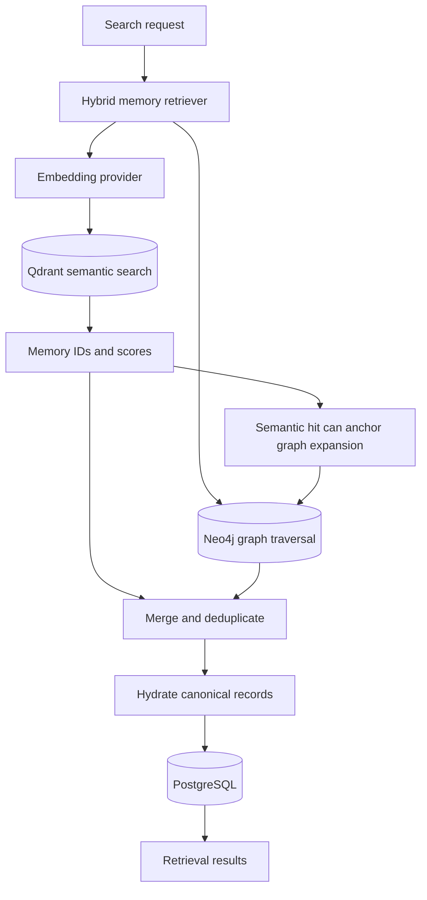
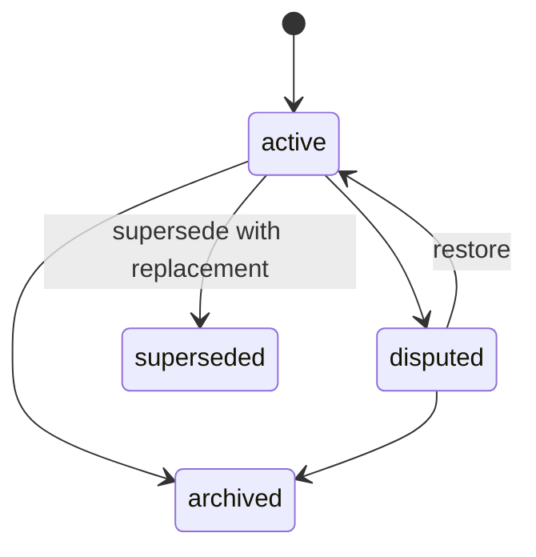

# AegisOps

**Operational memory for infrastructure and industrial asset operations.** AegisOps captures observations, incidents, diagnoses, actions, and resolutions, then makes them available through semantic, graph, and hybrid retrieval.

[Quickstart](#quickstart) · [Architecture](#architecture) · [API](#api) · [Testing](#testing) · [Retrieval evaluation](#retrieval-evaluation) · [Configuration](#configuration)

<details>
<summary>At a glance</summary>

| Concern | AegisOps component |
| --- | --- |
| Canonical memory and lifecycle | PostgreSQL |
| Semantic index | Qdrant |
| Entity and relationship projection | Neo4j |
| Durable projection events | PostgreSQL outbox and Kafka |
| HTTP API and OpenAPI docs | FastAPI |
| Operator experience | Streamlit UI |
| Evidence-grounded answering | GraphRAG pipeline with configured LLM provider |

</details>

## Architecture

PostgreSQL owns canonical memory content. Qdrant and Neo4j are derived retrieval projections; Kafka carries outbox events for projection consumers. A successful database commit is not rolled back when a best-effort index operation fails.



### Retrieval path



**Retrieval contract:** Qdrant and Neo4j return candidate memory IDs. PostgreSQL hydrates the canonical records returned by the API. In graph mode, supply an `anchor_memory_id` when the query does not otherwise provide an anchor.

### Memory lifecycle



## Quickstart

<details open>
<summary>Start the local stack</summary>

**Requirements:** Docker Desktop or Docker Engine with Compose v2.

1. Configure local environment:

   ```bash
   cp .env.example .env
   ```

   Set a local `POSTGRES_PASSWORD` in `.env`. For anything beyond local development, use managed secrets and rotate credentials.

2. Build and start services:

   ```bash
   docker compose up -d --build
   ```

3. Create or upgrade the database schema:

  ```bash
  docker compose exec -T api alembic upgrade head
  ```

4. Check status and health:

   ```bash
   docker compose ps
   curl http://localhost:8000/health
   curl http://localhost:8000/api/v1/system/health
   ```

5. Open the interactive API documentation:

   - Swagger UI: <http://localhost:8000/docs>
   - ReDoc: <http://localhost:8000/redoc>
   - Streamlit UI: <http://localhost:8501>
   - Qdrant dashboard: <http://localhost:6333/dashboard>
   - Neo4j Browser: <http://localhost:7474>

</details>

### Compose services

| Service | Purpose | Local endpoint |
| --- | --- | --- |
| `api` | FastAPI memory, retrieval, health, and observability routes | `http://localhost:8000` |
| `postgres` | Canonical memory database and projection outbox | `localhost:5432` |
| `qdrant` | Vector index | `http://localhost:6333` |
| `neo4j` | Graph projection and traversal | `http://localhost:7474`, Bolt `localhost:7687` |
| `kafka` | Projection event transport | `localhost:9092` |
| `outbox-publisher` | Publishes committed outbox events to Kafka | Internal service |
| `ui` | Streamlit operator interface | `http://localhost:8501` |

## API

Feature routes are under `/api/v1`; the process health check is at `/health`. The OpenAPI schema at `/docs` is the authoritative source for request and response details.

<details>
<summary>Memory and system routes</summary>

| Method | Route | Purpose |
| --- | --- | --- |
| `POST` | `/memories` | Create a memory |
| `GET` | `/memories` | List and filter memories |
| `GET` | `/memories/{id}` | Fetch one canonical memory |
| `PATCH` | `/memories/{id}` | Update a memory |
| `POST` | `/memories/{id}/archive` | Archive a memory |
| `POST` | `/memories/{id}/dispute` | Mark a memory disputed |
| `POST` | `/memories/{id}/supersede` | Replace a memory and preserve its history |
| `POST` | `/search/semantic` | Search Qdrant and hydrate results from PostgreSQL |
| `POST` | `/search/hybrid` | Run semantic, graph, or hybrid retrieval |
| `POST` | `/search/graph-related` | Traverse graph relationships from a memory anchor |
| `POST` | `/graphrag/query` | Retrieve evidence and generate an answer |
| `GET` | `/system/health` | Check database, index, graph, and LLM health |
| `GET` | `/system/memory-stats` | Count memories by type and status |
| `GET` | `/system/outbox-stats` | Inspect projection outbox status |
| `GET` | `/system/observability` | Read application/runtime metrics |

</details>

<details>
<summary>Create a memory with curl</summary>

```bash
curl -X POST http://localhost:8000/api/v1/memories \
  -H "Content-Type: application/json" \
  -d '{
    "memory_type": "observation",
    "title": "Pump vibration elevated",
    "content": "Pump P-102 vibration is above the configured operating threshold.",
    "source_type": "sensor",
    "asset_id": "pump-p102",
    "facility_id": "facility-west",
    "confidence": 0.95,
    "importance": 0.8
  }'
```

</details>

<details>
<summary>Run hybrid retrieval with curl</summary>

```bash
curl -X POST http://localhost:8000/api/v1/search/hybrid \
  -H "Content-Type: application/json" \
  -d '{
    "query": "Pump P-102 vibration increased after maintenance",
    "mode": "hybrid",
    "limit": 10,
    "graph_hops": 2
  }'
```

</details>

## Testing

Run tests in the API container so database-backed tests use the same Compose network and environment as the application.

```bash
# Full suite
docker compose exec -T api python -m pytest -q

# Focused suites
docker compose exec -T api python -m pytest tests/api/ -q
docker compose exec -T api python -m pytest tests/services/ -q
docker compose exec -T api python -m pytest tests/retrieval/ tests/semantic/ tests/graph/ -q
docker compose exec -T api python -m pytest tests/evals/ -q
```

> **Embedding note:** the default `DeterministicFakeEmbedding` is a repeatable SHA-256-based test embedding, not a semantic model. It is useful for deterministic integration tests and plumbing checks, but its similarity results should not be interpreted as semantic retrieval quality.

## Retrieval evaluation

Two datasets are intentionally kept separate:

- **Human-labeled gold standard:** `evals/queries.jsonl`. This file is never written by the source-grounded generator.
- **Source-grounded weak supervision:** `data/evaluation/source_grounded_queries.json`, generated from manufacturer source records with canonical memory IDs and a source manifest.

> **These metrics come from a source-grounded / weakly-supervised benchmark. Relevance labels were derived from manufacturer troubleshooting records rather than independently authored human judgments.**

<details>
<summary>Generate and run the source-grounded benchmark</summary>

Rebuild the Compose image first so it contains the current repository files, then generate/import the source records and run the benchmark:

```bash
docker compose up -d --build

docker compose exec -T api python -m evals.source_grounded_dataset \
  --api-url http://localhost:8000 \
  --qdrant-url http://qdrant:6333

docker compose exec -T api python -m evals.run_benchmark \
  --dataset source-grounded --k 10 --repeats 5 --warmup 1
```

The runner validates source metadata, query IDs, relevance IDs, and membership in both the generated corpus and canonical PostgreSQL. It uses a separate Qdrant collection for the source-grounded corpus and rejects retrieval candidates outside that corpus.

The container writes generated datasets and results under `/app/data/evaluation` and `/app/results/evaluation/source_grounded`. Copy them into the checkout to retain them outside the container:

```bash
docker cp aegisops-api:/app/data/evaluation ./data/evaluation
docker cp aegisops-api:/app/results/evaluation/source_grounded ./results/evaluation
```

Each timestamped result directory contains `summary.json`, `summary.csv`, `per_query_results.csv`, `benchmark_metadata.json`, `source_manifest.json`, and `summary.md`.

</details>

<details>
<summary>Run the human-labeled benchmark</summary>

Create `evals/queries.jsonl` from the template, replace all example labels with human judgments referencing canonical PostgreSQL UUIDs, then run:

```bash
docker cp evals/queries.jsonl aegisops-api:/app/evals/queries.jsonl
docker compose exec -T api python -m evals.validate_queries --file evals/queries.jsonl
docker compose exec -T api python -m evals.run_benchmark --dataset human-labeled \
  --queries evals/queries.jsonl --k 10 --repeats 5 --warmup 1
docker cp aegisops-api:/app/evals/results ./evals/results
```

The human-labeled file is not included in the repository by default. The template at `evals/queries.template.jsonl` is not a valid benchmark dataset.

</details>

### Current source-grounded dataset limits

The checked-in seed corpus contains six records derived from one KEYENCE IV4 source page, expanded into ten fixed-template queries per record. These 60 queries are not 60 independent field incidents. Results from the current fake embedding provider validate execution and retrieval plumbing only. Broader retrieval conclusions require more independently sourced manufacturer records and a semantic embedding provider.

See the [evaluation guide](evals/README.md), [generated source manifest](data/evaluation/source_manifest.json), and [latest benchmark summary](results/evaluation/source_grounded/20261005T235309Z/summary.md).

## Database migrations

```bash
# Apply committed migrations
docker compose exec -T api alembic upgrade head

# Inspect the current migration revision
docker compose exec -T api alembic current

# Generate a migration after changing SQLAlchemy models
docker compose exec -T api alembic revision --autogenerate -m "describe change"
```

## Configuration

Compose supplies service hostnames such as `postgres`, `qdrant`, and `neo4j` to containers. When running code directly on the host, use host-published addresses and provide the required environment variables in that shell.

| Variable | Compose default | Purpose |
| --- | --- | --- |
| `DATABASE_URL` | constructed from Postgres variables | SQLAlchemy connection string; required by the app |
| `POSTGRES_DB` | `aegisops` in `.env.example` | Database name |
| `POSTGRES_USER` | `aegisops` in `.env.example` | Database user |
| `POSTGRES_PASSWORD` | `change_me` in `.env.example` | Local database password; replace before use |
| `POSTGRES_HOST` | `postgres` | Database hostname inside Compose |
| `POSTGRES_PORT` | `5432` | Database port |
| `QDRANT_URL` | `http://qdrant:6333` | Qdrant endpoint |
| `QDRANT_COLLECTION_NAME` | `memories` | Production semantic collection |
| `NEO4J_URI` | `bolt://neo4j:7687` | Neo4j Bolt endpoint |
| `NEO4J_USERNAME` | `neo4j` | Neo4j username |
| `NEO4J_PASSWORD` | `aegisops` in Compose | Neo4j local-development password |
| `NEO4J_DATABASE` | `neo4j` | Neo4j database |
| `KAFKA_BOOTSTRAP_SERVERS` | `kafka:9092` | Kafka bootstrap address |
| `KAFKA_PROJECTION_TOPIC` | `aegisops.memory.projections.v1` | Projection event topic |
| `LLM_PROVIDER` | `test` in Compose | GraphRAG provider selection |
| `LLM_MODEL` | configured model name | Model identifier for the configured provider |
| `OPENAI_API_KEY` | unset | Provider credential when required |

## Project map

<details>
<summary>Expand repository structure</summary>

```text
app/
  agents/          agent workflow, state, tools, and critic
  api/             FastAPI routes, schemas, dependencies, errors
  core/            application configuration
  db/              SQLAlchemy models, sessions, and base
  embeddings/      embedding provider and deterministic test provider
  evaluation/      application evaluation metrics and models
  graph/           Neo4j graph projection and traversal
  graphrag/        evidence context, answer pipeline, LLM providers
  memory/          candidate memory and promotion logic
  observability/   request, retrieval, and runtime metrics
  outbox/          transactional projection events and Kafka publisher
  repositories/    PostgreSQL persistence
  retrieval/       semantic, graph, and hybrid result assembly
  semantic/        Qdrant semantic index
  services/        memory lifecycle and projection services

evals/             reproducible retrieval benchmark and validators
data/evaluation/   source-grounded memory/query dataset and manifest
results/evaluation/ timestamped source-grounded benchmark artifacts
tests/             API, service, storage, graph, retrieval, and eval tests
docs/design/       design notes and service contracts
ui/                Streamlit operations interface
alembic/           PostgreSQL schema migrations
```

</details>

## Operations

<details>
<summary>Stop services and manage local data</summary>

```bash
# Stop containers but preserve database/index volumes
docker compose down

# Destructive: stop containers and permanently remove local volumes/data
docker compose down -v
```

</details>

## Design references

- [Memory engine design](docs/design/memory-engine-design.md)
- [Memory service contract](docs/design/memory-service-contract-v2.md)
- [Event-driven architecture review](docs/design/PHASE_3_EVENT_DRIVEN_ARCHITECTURE_REVIEW.md)
- [Retrieval evaluation guide](evals/README.md)
